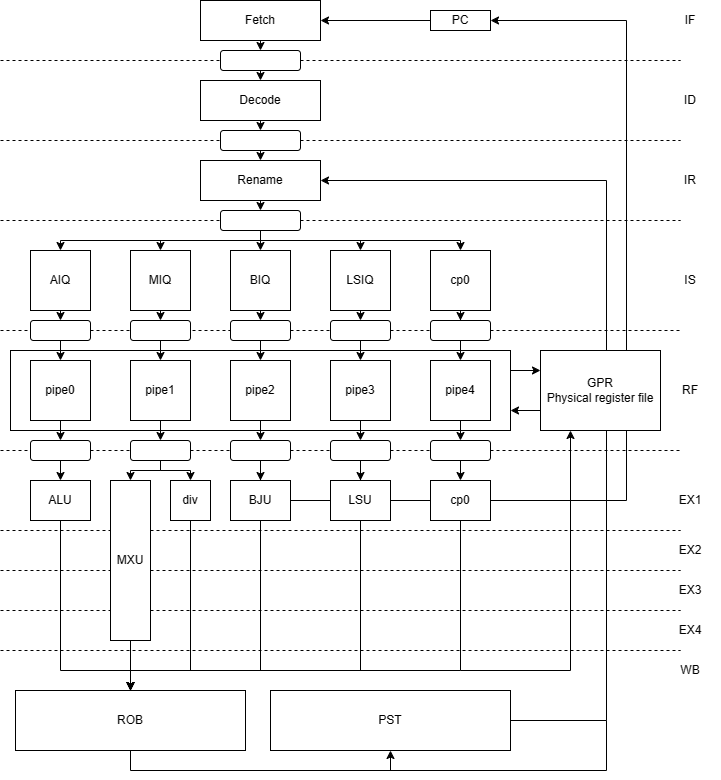

# 开岁 —— 一个简单的 7 级流水标量乱序 RISC-V 核

这个仓库是作者的本科毕业设计，支持 RV64IM 指令集和常规计算指令（单周期 ALU 指令和多周期乘除指令）的乱序执行（但无分支预测、cache、LSU乱序、中断异常等）。

大约就是学习体系结构几个月后的试做，也用来作为自己想法的验证，并为本科生涯画个句号。不知道以后我还有没有兴趣接着搞进一步的设计，于是斗胆取个有连续性的名字，取《诗经》中的月份雅称作名：

> 正月开岁 二月绀香 三月桃良  
> 四月秀蔓 五月鸣蜩 六月精阳  
> 七月流火 八月未央 九月授衣  
> 十月获稻 葭月潜龙 腊月嘉年

第一个设计就称为“开岁”吧

代码依托于香山项目（其实按理来说应该是一生一芯）所使用的 NEMU 环境，内存读写也是直接使用 NEMU 提供的接口。但环境代码并不具备通用性，所以这个仓库不带环境（显然这些依托 NEMU 的 DPI-C 接口都是未来应该被优化的部分）

## 架构

整体架构模仿玄铁c910，如下图所示：

七级流水线包括取指（Instruction Fetch， IF）、译码（Instruction Decode，ID）、重命名（Instruction Rename，IR）、发射（Instruction Issue，IS）、读寄存器（Register File，RF）、执行（Execute，EX）和回写（Write Back，WB）。此外还有退休单元（Retire Unit， RTU）用于管理寄存器状态表（Physical Register Status Table，PST）和重排序缓冲区（Re-order Buffer， ROB）。

IF阶段用于取出处理器需要执行的指令。PC可以看作BJU单元的保留站，可以记录一个最老的有效跳转地址和PC指针。当BJU计算出跳转地址时，其将跳转地址写入PC单元的跳转地址保留站，当ROB中的跳转指令产生退休信号时再将跳转地址保留站中的值载入到PC寄存器中。其余情况下，若流水线中无阻塞发生，PC始终自增。在时钟上升沿取指单元对PC采样并通过DPI-C接口从测试环境模拟的内存中取出指令。

ID阶段将指令解码为微操作（micro-operation，uop），以便流水线能够理解和执行。除了基本的指令类型、源操作数、目的操作数和立即数等基本信息外，译码单元还负责确定指令应该进入哪个执行管道、是否需要重命名、是否为跳转指令等，为后续ROB的退休管理和PST的维护提供必要的信息。

IR阶段对源寄存器和目的寄存器进行翻译，确定它们所映射的物理寄存器编号。源寄存器对应的物理寄存器用于在RF阶段读取数据，而目的寄存器对应的物理寄存器则提供给PST，在适当时机释放，以供其他指令进行重命名分配。同时，ROB为每个指令提供唯一的标识号（Instruction ID，IID），PST为有效的目的寄存器提供一个空闲物理寄存器，该寄存器在下一个时钟上升沿时更新到重命名表的映射项中。

IS阶段负责管理指令的发射。从这个阶段开始，指令执行不再是顺序的。指令从IR阶段进入IS阶段时，根据译码信息被派遣到不同的发射队列中。单周期的计算如加减、位运算等指令被分派到AIQ（Arithmetic Issue Queue）中，而多周期的乘除法指令则被分派到MIQ（Multiplication Issue Queue）中。这两个发射队列均允许队列内指令乱序执行。跳转指令被分配到BIQ（Branch Issue Queue），内存读写指令则被分派到LSIQ（Load-Store Issue Queue）中。ebreak属于特权切换指令，在测试环境中用于检测程序是否正常结束，被单独分派到cp0 IQ（Coprocessor 0 Issue Queue）中。后三个发射队列由于其各自指令性质，只被允许顺序执行。发射队列需要维护各个表项的源寄存器准备情况，选取最老且准备好的指令发射到各自的执行管道中。

RF阶段被选中的各条指令被发射到各自的执行管道中。被发射的指令从前馈数据通路或寄存器堆中取值，此后指令被发往各个执行单元中。

EX阶段各个指令依据其操作码进行计算。ALU（Arithmetic Logic Unit）负责计算简单算术操作，其需要1周期计算出结果；MXU（Multiplication Execute Unit）负责计算乘法操作，其需要4周期计算出结果，其内部由一个Booth乘法器、一个华莱士树加法单元和两个64位高速加法器组成，多条乘法可以流水化执行；DIVU（Division Execute Unit）负责计算除法操作，其使用恢复余数法进行计算，但无流水化处理，需要64周期计算出结果，且只能容纳一条除法指令进行；BJU（Branch Jump Unit）负责计算分支结果；LSU（Load-Store Unit）负责内存读写；cp0只负责处理ebreak指令。

WB阶段各个执行单元给出完成信号和回写数据。同时将ALU、MXU、DIV、LSU的计算结果前馈到RF级供后续指令使用。

此外，乱序执行处理器还会包含一个退休单元。ROB接收到指令完成信号时，若其处于ROB顶部，则该指令从表项中退休，同时更改PST中对应寄存器的状态。若指令为分支指令且该分支确认需要跳转，则ROB需要给出跳转信号和流水线冲刷信号；若指令为ebreak指令则需通知测试环境回收测试结果。

整体细节设计之后会单独写博客慢慢更新~